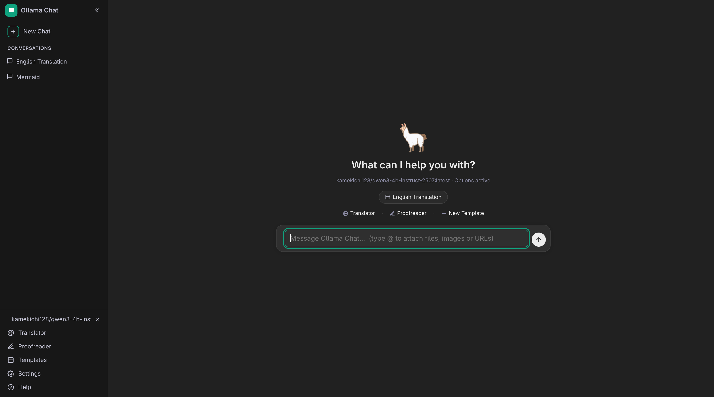

# ollama-chat

[](https://pypi.org/project/ollama-chat/) [](https://pypi.org/project/ollama-chat/) [](https://github.com/craigahobbs/ollama-chat/blob/main/LICENSE) [](https://pypi.org/project/ollama-chat/)

A local AI chat client powered by [Ollama](https://ollama.com). Runs entirely offline — no cloud, no data sharing.



## Features

- Chat with any local LLM via Ollama
- **Translator** and **Proofreader** built in
- **Conversation templates** with variable substitution
- **@ attachments** — include files, folders, images, URLs, or cURL responses in your prompt
- Context window usage indicator with token count
- Thinking mode for reasoning models
- Dark and light themes, mobile-friendly

## Usage

```sh
git clone https://github.com/craigahobbs/ollama-chat
cd ollama-chat
make run
```

Opens a browser window with the chat interface. A config file `ollama-chat.json` is created in your home directory on first run.

## API & File Format

- [Ollama Chat API](https://craigahobbs.github.io/ollama-chat/api.html)
- [File Format Reference](https://craigahobbs.github.io/ollama-chat/api.html#var.vName='OllamaChatConfig')
